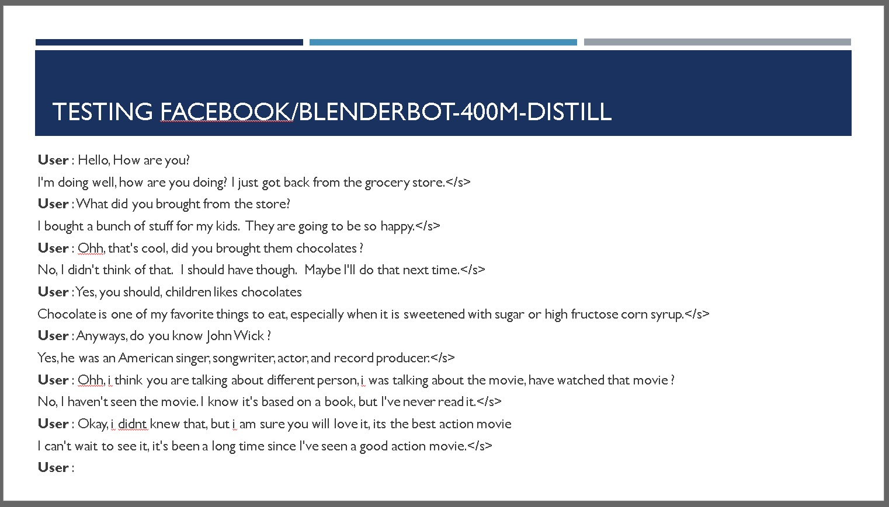
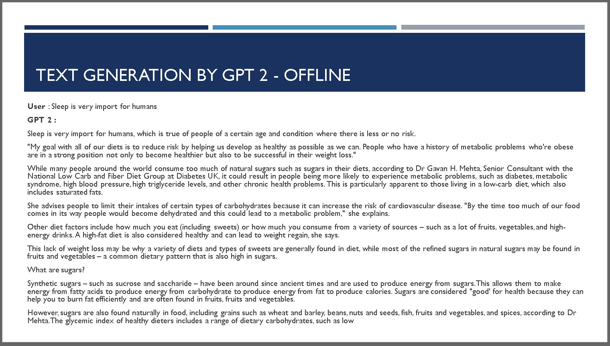
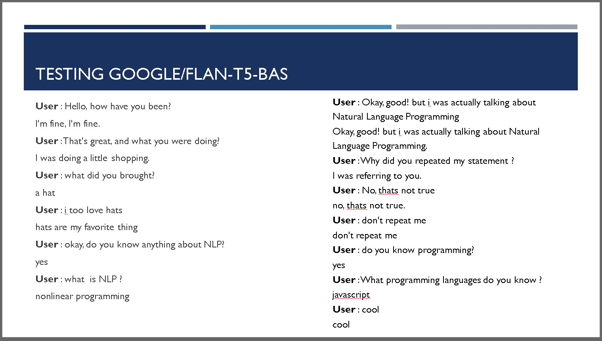

# Generative Models

Generative Models in Natural Language Processing (NLP) are designed to generate text or speech that resembles human language. These models learn the underlying distribution of the training data and use it to generate new, coherent text based on a given prompt or context. One of the most popular approaches in generative modeling is the use of neural networks, particularly the Transformer architecture. Generative models can be fine-tuned on large-scale language corpora and are capable of generating diverse and contextually relevant responses. They have applications in various NLP tasks such as language translation, text completion, and chatbot systems. The huggingface.com library provides prebuilt generative models that can be easily utilized for different NLP tasks, enabling developers to leverage cutting-edge language generation capabilities without the need for extensive training. With generative models, the possibilities of generating high-quality and creative text outputs are expanding, opening up exciting opportunities in the field of NLP.

## Blenderbot by Facebook

Blenderbot-400M-distill is an impressive prebuilt model developed by Facebook. It's like having a smart chatbot at your disposal! This model has been trained on a huge amount of real-life conversations, so it's great at generating human-like responses. It's compact yet powerful, striking a balance between performance and efficiency. With Blenderbot-400M-distill, you can build chatbots, virtual assistants, or even have interactive conversations. It's designed to understand context and provide engaging and meaningful responses. So, whether you want to create a helpful assistant or have a fun conversation, Blenderbot-400M-distill is ready to bring your chatbot dreams to life!



### How to use

1. Install Transformer : pip install Transformer
2. Install pytorch : pip3 install torch torchvision torchaudio
3. Use the file BlenderBot.py having below code, and run it :

```python
# Import the model class and the tokenizer
from transformers import BlenderbotTokenizer, BlenderbotForConditionalGeneration
# Download and setup the model and tokenizer
tokenizer = BlenderbotTokenizer.from_pretrained(
    "facebook/blenderbot-400M-distill")
model = BlenderbotForConditionalGeneration.from_pretrained(
    "facebook/blenderbot-400M-distill")
while True:
    utterance = input("User : ")
    if utterance != "kill":
        inputs = tokenizer(utterance, return_tensors="pt")
        res = model.generate(**inputs)
        print(tokenizer.decode(res[0]))
    else:
        break
```

4. Enjoy!

## GPT 2 by OpenAI

GPT-2, developed by OpenAI, is a remarkable language model that can generate text that feels incredibly human-like. It's like having a writing companion that can assist you in various creative endeavors! GPT-2 has been trained on a vast amount of diverse text from the internet, making it a versatile and powerful tool for generating text in a wide range of styles and topics. It can be used for writing stories, creating dialogues, generating code, and much more. GPT-2 has gained popularity due to its ability to generate coherent and contextually relevant text. With GPT-2, you can explore the boundaries of language generation and unlock new possibilities in your creative projects. Get ready to unleash your imagination with the impressive text generation capabilities of GPT-2!



### How to use

1. Install Transformer : ```pip3 install Transformer```
2. Install pytorch : ```pip3 install torch torchvision torchaudio```
3. Use the file GPT2.py having below code :

````python

# Code for GPT 2  == 600 MB
from transformers import AutoTokenizer, AutoModelForCausalLM

# Load the GPT-2 tokenizer
tokenizer = AutoTokenizer.from_pretrained("gpt2")

# Load the GPT-2 model
model = AutoModelForCausalLM.from_pretrained("gpt2")

# Generate text
while True:
    input_text = input("User : ")
    if input_text != "kill":
        input_ids = tokenizer.encode(input_text, return_tensors="pt")
        output = model.generate(input_ids=input_ids,
                                max_length=500, do_sample=True)
        generated_text = tokenizer.decode(output[0], skip_special_tokens=True)
        print(generated_text)
    else:
        break

````

## T5 : google/flan-t5-base

flan-t5-base, developed by Google, is an exceptional language model that offers an incredible user experience. It shares similarities with Blenderbot but surpasses it in terms of speed and efficiency. You'll be amazed at how fast it operates, almost in real-time! It's hard to believe that such a powerful machine learning model, weighing in at 970 MB, can deliver such lightning-fast performance. What's even more impressive is its minimal resource consumption. Despite its capabilities, flan-t5-base doesn't strain your system's resources. During my usage, the CPU usage remained consistently below 10%, even during intense conversations. It's truly remarkable how it achieves this level of performance with such efficiency. But the real magic happens when you engage in conversation. The responses generated by flan-t5-base are nothing short of impressive. It captures context exceptionally well and produces coherent and contextually relevant text. Prepare to be blown away by the impressive capabilities of flan-t5-base as you explore the realm of language generation.



### How to use

1. Install Transformer : ```pip3 install Transformer```
2. Install pytorch : ```pip3 install torch torchvision torchaudio```
3. Use the file GPT2.py having below code :

````python
# Code for google/flan-t5-base -- 970 MB

from transformers import AutoTokenizer, AutoModelForSeq2SeqLM

# Load the T5 tokenizer
tokenizer = AutoTokenizer.from_pretrained("google/flan-t5-base")

# Load the T5 model
model = AutoModelForSeq2SeqLM.from_pretrained("google/flan-t5-base")


# Generate text using the T5 model
while True:
    input_text = input("User : ")
    if input_text != "kill":
        input_ids = tokenizer.encode(input_text, return_tensors="pt")
        output_ids = model.generate(input_ids)
        output_text = tokenizer.decode(output_ids[0], skip_special_tokens=True)
        print(output_text)
    else:
        break
````

4. Enjoy!
